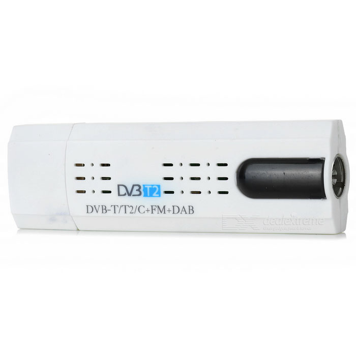
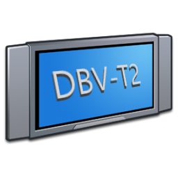
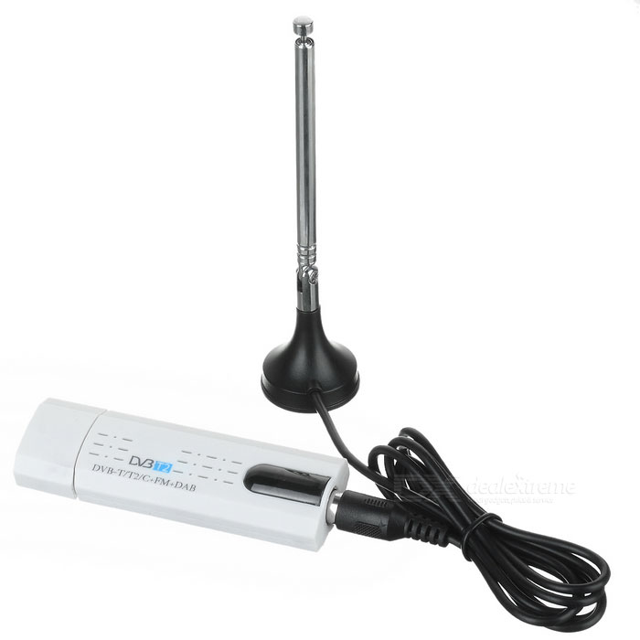
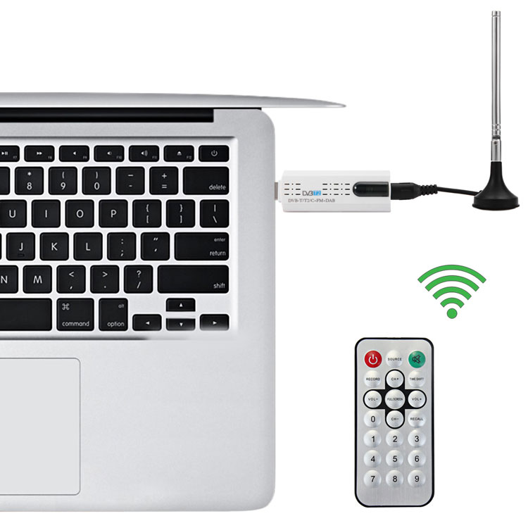
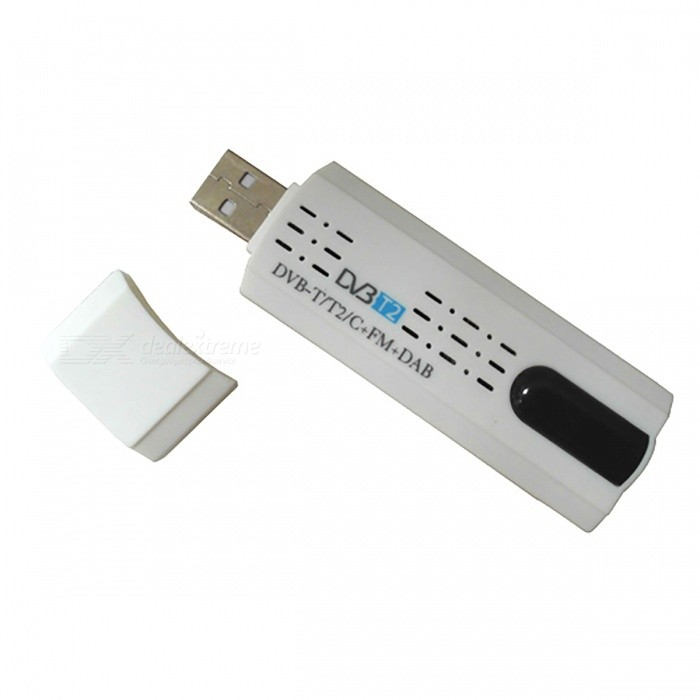
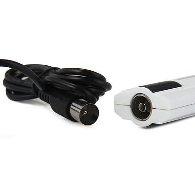

<pre>
<h1> Drivers And TVR For USB DVB-T/T2/C+FM+DAB</h1>

<blockquote>

This is a mirror.
You may download the driver(s) and application-version(s)
in here: <a href="http://www.astrometa.com.tw/integrated_en.html">http://www.astrometa.com.tw/integrated_en.html</a>
and here: <a href="http://www.astrometa.com.tw/Previous%20Versions.html">http://www.astrometa.com.tw/Previous%20Versions.html</a>
</blockquote>

<blockquote>
You are probably NOT holding a hybrid USB device,
those are quite rare to find on eBay,
usually more expensive and bigger in size.
if you DO need those look at the original website, 
this won't work for you.
</blockquote>

You need to choose a driver and a TVR to watch the broadcast itself,
<strong>You probably do not need the DVBC driver nor DVBC TVR.</strong>

For a driver, choose either 17xxxx or 16xxxx (older).
the 17xxxx build also requires a installing an update for your Windows,
you should prefer installing the 17xxxx builds.

You can choose "any mix" of driver/application versions.

Driver(s):

  Latest: Build 170427
    AMDVBT2 BDA Driver            [4.16MB] &nbsp; <a href="https://raw.githubusercontent.com/eladkarako/DBV-T2/master/resources/AMDVBT2_Setup_170427.exe">AMDVBT2_Setup_170427.exe</a> &nbsp; <a href="https://www.dropbox.com/s/ffckhetzp3vmjio/AMDVBT2_Setup_170427.exe?dl=0">mirror</a>.
    AMDVBT2 BDA driver for DVBC   [4.17MB] &nbsp; <a href="https://raw.githubusercontent.com/eladkarako/DBV-T2/master/resources/AMDVBC_Setup_170427.exe" >AMDVBC_Setup_170427.exe</a> &nbsp;   <a href="https://www.dropbox.com/s/g7ckkst7gib86sc/AMDVBC_Setup_170427.exe?dl=0">mirror</a>.

    <blockquote>
    Driver build 17xxxx requires a 'Security Update for Windows 7 (KB3033929)' which <a href="https://technet.microsoft.com/en-us/library/security/3033929.aspx">adds SHA-2 code signing support</a> for drivers.
      <a href="https://raw.githubusercontent.com/eladkarako/DBV-T2/master/resources/Windows6.1-KB3033929-x86.msu">Windows6.1-KB3033929-x86.msu</a> &nbsp; <a href="https://www.microsoft.com/en-us/download/details.aspx?id=46148">mirror</a>.
      <a href="https://raw.githubusercontent.com/eladkarako/DBV-T2/master/resources/Windows6.1-KB3033929-x64.msu">Windows6.1-KB3033929-x64.msu</a> &nbsp; <a href="https://www.microsoft.com/en-us/download/details.aspx?id=46078">mirror</a>.
    
    Download the one suited for your PC architecture,
    and either double-click it or use the Windows-Update Installer:
    <code>wusa.exe "Windows6.1-KB3033929-x64.msu" /quiet /norestart</code> (for example).
    
    if you don't want to install this you may choose the previous version 16xxxx below.
    </blockquote>

    Changelog:
    v170427
    - Improved stability and accuracy when scanning multi-plp channels
    - New digital signature
    
  

  Previous: v160614
    AMDVBT2 BDA Driver            [4.12MB] &nbsp; <a href="https://raw.githubusercontent.com/eladkarako/DBV-T2/master/resources/AMDVBT2_Setup_160614.exe">AMDVBT2_Setup_160614.exe</a> &nbsp; <a href="https://www.dropbox.com/s/l03q4r96i520h0i/AMDVBT2_Setup_160614.exe?dl=0">mirror</a>.
    AMDVBT2 BDA driver for DVBC   [4.12MB] &nbsp; <a href="https://raw.githubusercontent.com/eladkarako/DBV-T2/master/resources/AMDVBC_Setup_160614.exe">AMDVBC_Setup_160614.exe</a> &nbsp;    <a href="https://www.dropbox.com/s/y2e59xh8wfx0tu5/AMDVBC_Setup_160614.exe?dl=0">mirror</a>.

    Changelog:
    v160614
    - Improved power control, No longer hot when dongle is not in use
    - Faster firmware download, no delay on system booting

TVR Application.
  Latest version 4.7.9 Build 170504
    TVR                [18.70MB] &nbsp; <a href="https://raw.githubusercontent.com/eladkarako/DBV-T2/master/resources/TVR_Setup_V4.7.9.exe">TVR_Setup_V4.7.9.exe</a> &nbsp;      <a href="https://www.dropbox.com/s/3t1b4jm4r6uxydp/TVR_Setup_V4.7.9.exe?dl=0">mirror</a>.
    DVBC TVR           [18.70MB] &nbsp; <a href="https://raw.githubusercontent.com/eladkarako/DBV-T2/master/resources/TVR_DVBC_Setup_V4.7.9.exe">TVR_DVBC_Setup_V4.7.9.exe</a> &nbsp; <a href="https://www.dropbox.com/s/cy823cnthstyg8e/TVR_DVBC_Setup_V4.7.9.exe?dl=0">mirror</a>.

  Changelog:
  v170504
  - Fixed several crash issues on channel scanning and switching
  - Fixed video acceleration  not supported on some Intel display cards
  - Fixed external audio decoder selection is not remembered on exit (ex. Auto)
  - Fixed no sound on some TV channels with mpeg mono audio
  - Miscellaneous bug fixes

If you have runtime error, or your program does not run,
download VC10 runtime from here: [4.66MB] <a href="https://github.com/eladkarako/vc-archive/raw/master/archives/vc10_(10.0.40219.1)_2010_x86.7z">vc10_(10.0.40219.1)_2010_x86.7z</a>
and extract it to the same folder as the exe files.

It is recommanded that you'll download this fix for 
TVR/DVBC TVR (v4.7.9)

If you've installed <code>TVR_Setup_V4.7.9.exe</code> download <a href="https://raw.githubusercontent.com/eladkarako/DBV-T2/master/resources/EXE__TVR_Setup_V4.7.9.7z">EXE__TVR_Setup_V4.7.9.7z</a>
and if you've installed <code>TVR_DVBC_Setup_V4.7.9.exe</code> download <a href="https://raw.githubusercontent.com/eladkarako/DBV-T2/master/resources/EXE__TVR_DVBC_Setup_V4.7.9.7z">EXE__TVR_DVBC_Setup_V4.7.9.7z</a>.

Extract the 7zip archive, overwrite the existing exe files (TVRplayer.exe, RC.exe, DVBC-TVR.exe)
it has a fixed manifest resources for better GDI+ text rendering, high-DPI screens and Windows10 support.

Help/Starting Guide (PDF)
  [1.38MB] &nbsp; <a href="https://raw.githubusercontent.com/eladkarako/DBV-T2/master/resources/AstroMeta_TVR.pdf">AstroMeta_TVR.pdf</a> &nbsp; <a href="http://www.astrometa.com.tw/Files/AstroMeta%20TVR.pdf">mirror</a>.

Decode Digital Content (MP4)
Download <a href="http://www.codecguide.com/download_k-lite_codec_pack_mega.htm">K-Lite's Codec-Pack Mega</a>,
it includes LAV decoder (and other codecs) with H.264 and H.265 support.

On the TVR (advanced-setup) keep "external audio/video decoder" to "auto".

 

this is a bad thing.... 
if you want to use an unsigned driver you MUST first run <code>cmd</code> as admin, 
and than:
<pre>
bcdedit.exe -set loadoptions DDISABLE_INTEGRITY_CHECKS
bcdedit.exe -set TESTSIGNING ON
</pre>
it will help to avoid boot-messages that requires F8 to continue...

this is a good thing...  

 
 

 

 

 
</pre>
 
Keywords:
RTL283X,RTL2832,Astrometa,DVB-T2,DTV Filter,USB Driver,BDA Driver,AMDVBT2,Device installation,RTL2832U,Realtek Semiconduct Corp,RTL2832U IRHID Driver,HID Infrared Remote Receiver,Realtek IR Driver Disk,HID Infrared Remote Driver Disk,AMDVBT2DEV,AMDVBT2USB,Astrometa DVB-C,Astrometa DVB,Windows6.1-KB3033929-x64.msu,Windows6.1-KB3033929-x86.msu
